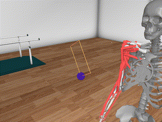
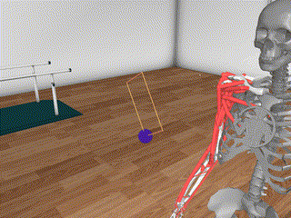
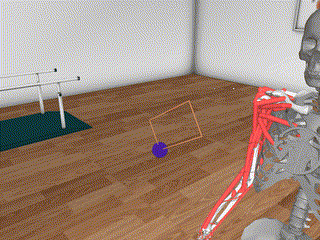
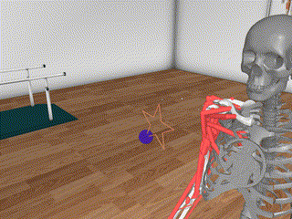
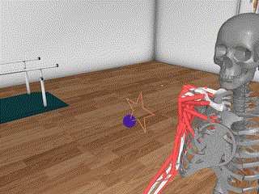
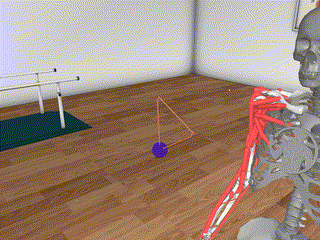
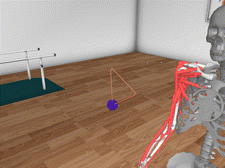
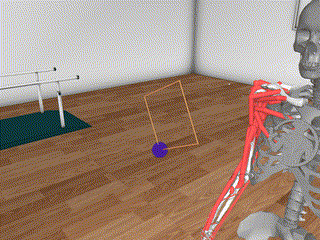
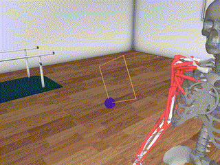
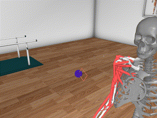

# Curriculum Learning for Shape Tracing with MyoArm

PPO experiments comparing curriculum-learning strategies on a square
shape-tracing task built on top of MyoSuite's `myoArmReachRandom-v0`
musculoskeletal arm environment.

The agent must move the fingertip through a sequence of waypoints that
trace out a square in 3D space. Square scale, in-plane rotation, and
vertical position are randomized within configurable ranges.

## Strategies

| Script | Strategy |
|---|---|
| `train_noCL_square_ppo.py` | Baseline: parameters sampled uniformly from the full ranges |
| `train_CL_small2large_square_ppo.py` | Curriculum: small squares first, then progressively larger and more rotated |
| `train_CL_large2small_square_ppo.py` | Curriculum: large squares first, then progressively smaller and more rotated |

Curriculum runs advance to the next level when the eval success rate on
the current level exceeds a threshold (configured per level).

## Repository layout

```
constants.py                  shared task constants & final eval levels
shape_tracing_myoarm.py       gym wrapper that turns myoArmReach into a tracing task
curriculum.py                 CurriculumState, wrapper, and eval callback
utils.py                      MetricsTracker + SB3 callbacks + final-evaluation helper
train_cl_runner.py            shared CL training entrypoint
train_noCL_square_ppo.py      baseline training script
train_CL_small2large_square_ppo.py
train_CL_large2small_square_ppo.py
test_model.py                 evaluation / rendering / GIF export for trained models
```

## Install

```bash
python -m venv .venv
source .venv/bin/activate
pip install -r requirements.txt
```

MyoSuite has its own setup requirements (MuJoCo, etc.); see the
[MyoSuite docs](https://github.com/MyoHub/myosuite) if installation fails.

## Run

```bash
# Baseline
python train_noCL_square_ppo.py --seed 0

# Curriculum (small -> large)
python train_CL_small2large_square_ppo.py --seed 0

# Curriculum (large -> small)
python train_CL_large2small_square_ppo.py --seed 0
```

All scripts accept `--seed`, `--total-timesteps`, `--n-envs`, and
`--log-dir`. Outputs land in `./experiments/<run_name>/` by default.

Monitor training:

```bash
tensorboard --logdir ./experiments
```

## Outputs per run

```
experiments/<run_name>/
├── config.json
├── final_model.zip
├── best_model/best_model.zip
├── checkpoints/model_<step>.zip
├── curriculum_history.json   (CL runs only)
├── train_metrics/{monitor.csv, train_metrics.json}
├── eval_metrics/{monitor.csv, eval_metrics.json}
└── tensorboard/
```

## Qualitative results

|  | No Curriculum Learning | Curriculum Learning |
|---|:---:|:---:|
| **tall Rectangle** |  |  |
| **wide Rectangle** |  |  |
| **Star** |  |  |
| **Triangle** |  |  |
| **Forward direction** |  |  |
| **Reversed direction** |  |  |
